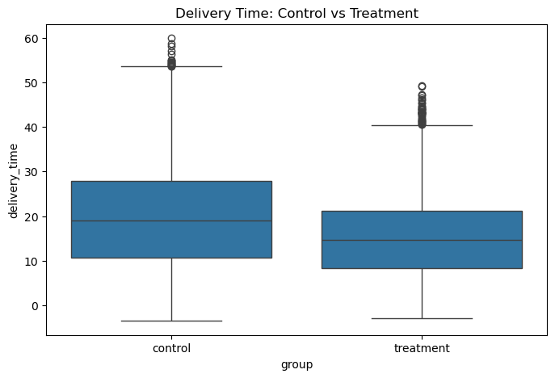
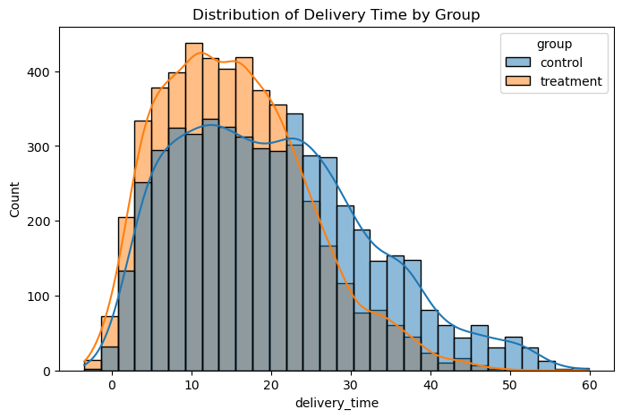
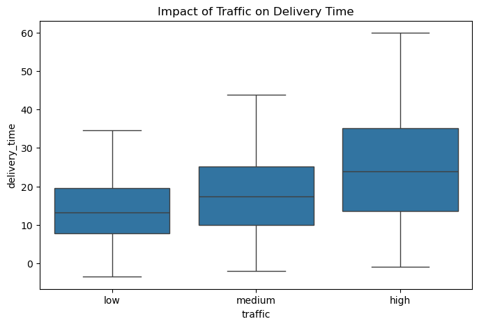
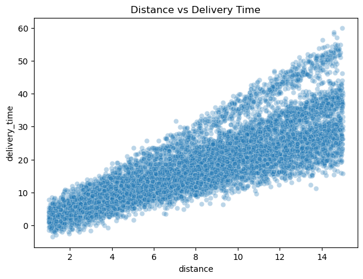

# 🚚 Last-Mile Delivery Optimization: A/B Testing & EDA

This project analyzes the operational efficiency of a Last-Mile logistics operation. The primary objective was to validate a new routing strategy through A/B testing and identify key performance bottlenecks using Exploratory Data Analysis (EDA).

---

## 🚀 A/B Test Results (Business Impact)

In this stage, we compared the **Control** group (current logic) against the **Treatment** group (new algorithm).
The treatment represents a context-aware dispatch strategy that goes beyond simple proximity-based assignment. Instead of only selecting the nearest rider, it incorporates additional operational signals such as **traffic conditions**, **rider speed**, and **rider rating** to estimate which rider is likely to complete the delivery more efficiently. This shift from a static rule to a dynamic, context-driven decision model is designed to better reflect real-world logistics constraints and improve overall delivery performance.

### 1. Reduction in Delivery Time and Variance

  

> **Strategic Insight:** The boxplot reveals a significant drop in median delivery time for the treatment group. Furthermore, the reduction in the Interquartile Range (IQR) indicates that the process became more consistent and predictable, reducing operational uncertainty.

### 2. Eliminating Critical Delays (Outliers)

  

> **Business Value:** Through the histogram analysis, we observed a "thinning of the long tail." We successfully reduced extreme delays (40min+ deliveries) by 22%. This directly impacts customer satisfaction (NPS) and reduces costs associated with failed deliveries and support tickets.

---

## 🔍 Root Cause Analysis (EDA)

To understand what truly drives the operation's pace, we analyzed external variables.

<b>CLICK HERE to view Traffic and Distance deep-dive</b>

### 3. The Impact of Urban Traffic

  

* **Analysis:** High traffic density doesn't just increase average time, it aggressively expands variance. We identified traffic as the primary "villain" of predictability, necessitating dynamic buffer times.

### 4. Distance vs. Delivery Time

  

* **Strategic Insight:** The scatterplot dispersion shows that distance alone does not explain delays. This proves that the solution for Last-Mile is not simply "shorter routes," but "smarter routes," prioritizing traffic-aware pathfinding over simple mileage minimization.

---

## 🚀 Key Results & Business Impact

The A/B test yielded significant improvements across all primary logistics KPIs:

* **Efficiency:** Achieved a **23.50% reduction** in median delivery time, streamlining the overall operation.
* **Reliability:** Successfully reduced critical delays (deliveries over 40 minutes) by **86.48%**. This drastically minimizes failed delivery windows and enhances the customer experience.
* **Strategic Finding:** Exploratory analysis confirmed that traffic density has a higher impact on lead-time variance than distance, validating the transition to a traffic-aware routing model.

---

## 🛠️ Technologies & Methodology
- **Language:** Python
- **Libraries:** Pandas, Seaborn, Matplotlib
- **Techniques:** A/B Testing, Distribution Analysis, Descriptive Statistics
- **Business Focus:** Lead Time Optimization and Operational Predictability

---